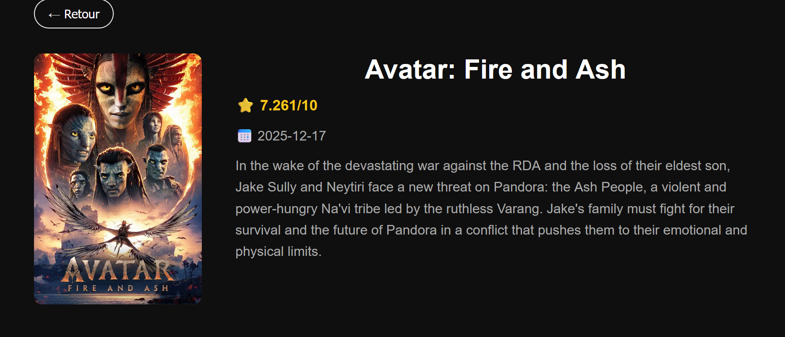
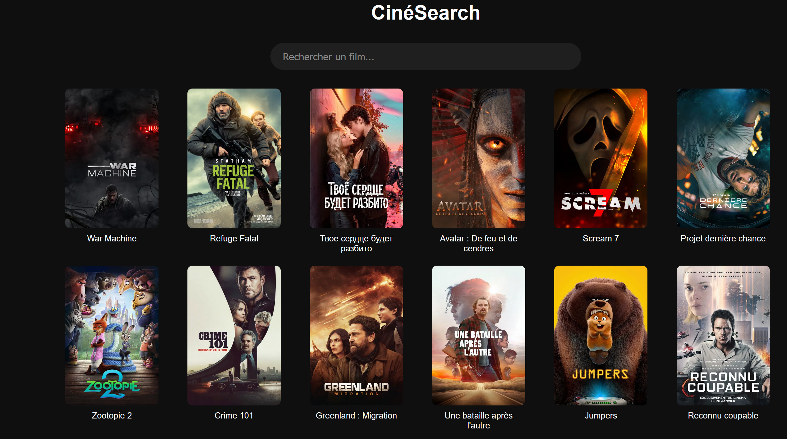
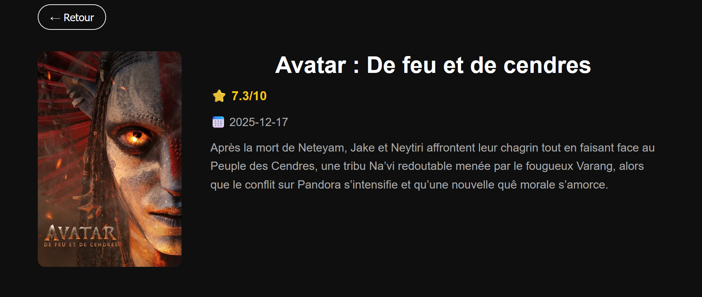
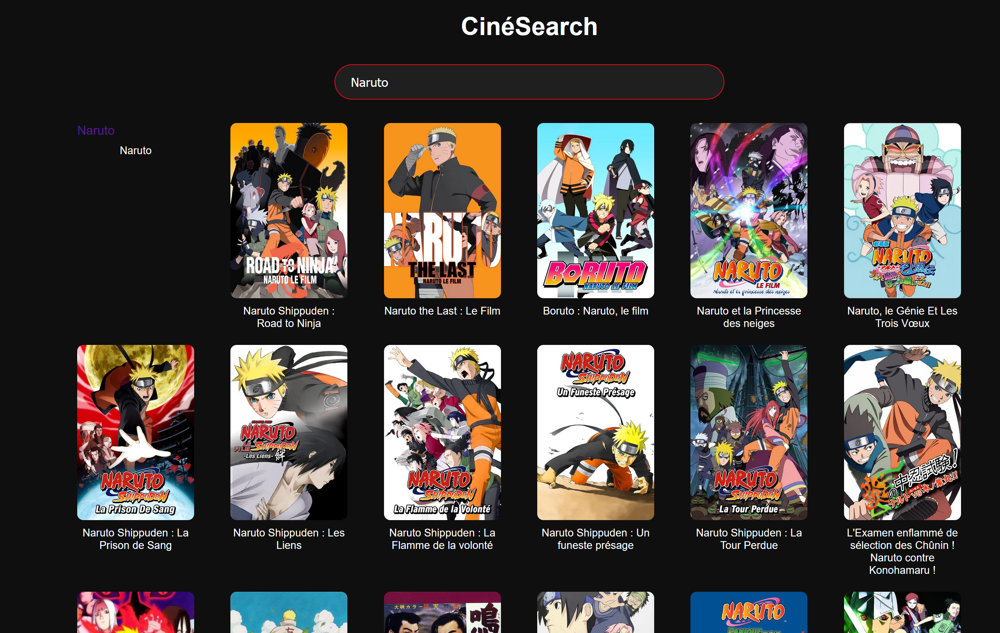

# CinéSearch

Application web de recherche et d'exploration de films, construite avec React et l'API TMDB.

---

## Pourquoi ce projet ?

Ce projet a été réalisé en dehors du cadre scolaire dans le but de progresser sur des technologies que je n'ai pas eu l'occasion de pratiquer en cours comme la consommation d'une API REST, la gestion d'état avec React et la navigation entre pages avec React Router.

---

## Fonctionnalités

- Affichage des films populaires du moment
- Recherche dynamique avec debounce
- Page de détail par film (synopsis, note, date de sortie)
- Interface en français via l'API TMDB
- Navigation sans rechargement de page (SPA)

---

## Technologies utilisées

- **React** — bibliothèque UI
- **Vite** — environnement de développement
- **React Router** — navigation entre pages
- **Axios** — requêtes HTTP
- **TMDB API** — données des films

---

## Installation
```bash
git clone https://github.com/TON_USERNAME/cine-search.git
cd cine-search
npm install
```

Crée un fichier `.env.local` à la racine :
```
VITE_TMDB_API_KEY=ton_jeton_dacces_tmdb
```

Lance le projet :
```bash
npm run dev
```

---

## Aperçu





